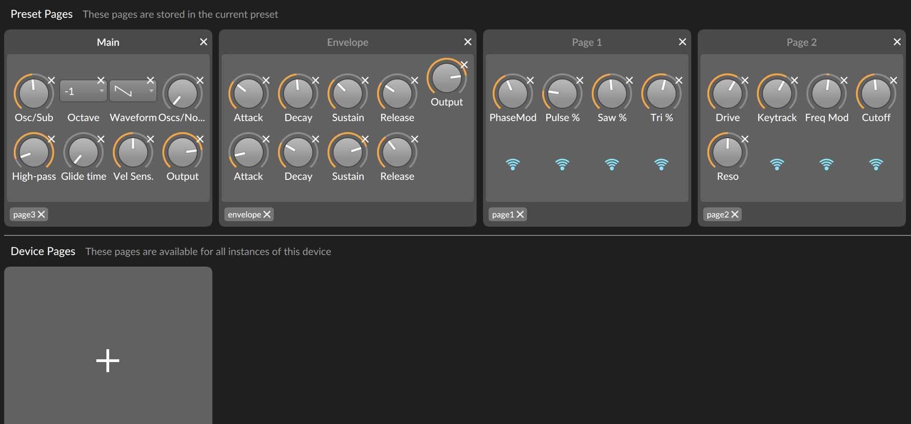

# bitwig-faderfox_pc4
Faderfox PC4 controller script for Bitwig Studio

Adds three controllers. 

**Device 8**: uses pots 1-8 as macro knobs and 9-24 can be used for manual MIDI learning of controls.

**Device 16**: uses pots 1-8 as macro knobs for params with the tag "page1" added, 9-16 as macro knobs for params with the tag "page2" added and 17-24 can be used for manual MIDI learning of controls.

 **Device 24**: uses pots 1-8 as macro knobs for params with the tag "page1" added, 9-16 as macro knobs for params with the tag "page2" added and 17-24 as macro knobs for params with the tag "page3" added.

 Example device page with tags:

